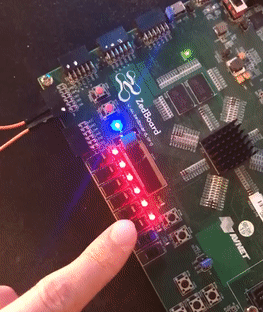

Verilog UART implementation.  
Install cocotb:
* pip3 install cocotb  

Install icarus verilog:
* sudo apt install iverilog

Run tests with:  
* make --directory=uart_rx
* make --directory=uart_tx

#### REAL HARDWARE!!!:

